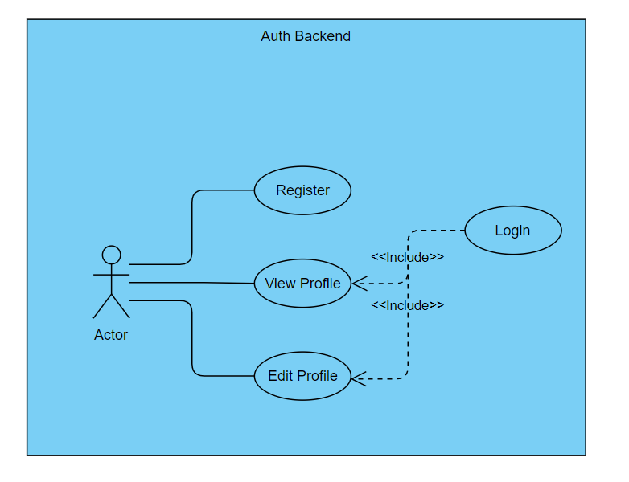
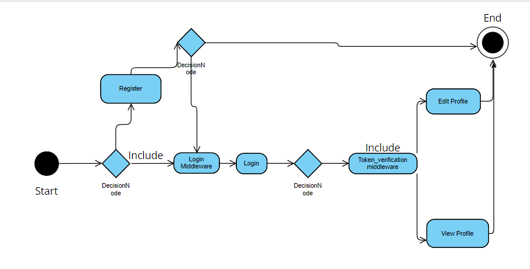

# BeWyse Backend Auth App

A small django Authentication mechanism

## Use Case


## Activity Diagram



## Technologies Used
* Django           
* REST API
* Firebase          


## Steps To Run 
* cd bewyse
* python manage.py makemigrations
* python manage.py runserver 

### API Endpoints

* POST /accounts/register/
* POST  /accounts/login/
* GET /accounts/profile/view/
* POST /accounts/profile/edit/


## API Reference

#### Register A User

```http
  GET  /accounts/register/
```

| Parameter  | Type     | Description                |
| :--------  | :------- | :------------------------- |
| `username` | `string` | **Required**.              |
| `email`   | `string`   | **Required**.  |
| `password` | `string` | **Required**.  |
| `first_name` | `string` | **Required**.  |
| `last_name` | `string` | **Required**.  |

#### Login A User

```http
  POST  /accounts/login/
```

| Parameter | Type     | Description                       |
| :-------- | :------- | :-------------------------------- |
| `email`      | `string` | **Required**. Id of item to fetch |
| `password`      | `string` | **Required**. Id of item to fetch |

#### View Profile

```http
  GET  /accounts/profile/view
  HTTP_CUSTOM_TOKEN: custom_token

```

| Parameter | Type     | Description                       |
| :-------- | :------- | :-------------------------------- |
| `username`      | `string` | **Required**. Id of item to fetch |

#### Edit Profile

```http
  POST  /accounts/profile/edit
  HTTP_CUSTOM_TOKEN: custom_token

```

| Parameter | Type     | Description                       |
| :-------- | :------- | :-------------------------------- |
| `username`      | `string` |  |
| `first_name`      | `string` |  |
| `last_name`      | `string` |  |


# Connect @
* LinkedIn: https://www.linkedin.com/in/satender-kumar-600bb3179/
* Leetcode: https://leetcode.com/satenderk8700
* Email: satenderk8700@gmail.com   

# Personal
Name: Satender Kumar  

# Gratitude
Thank You
